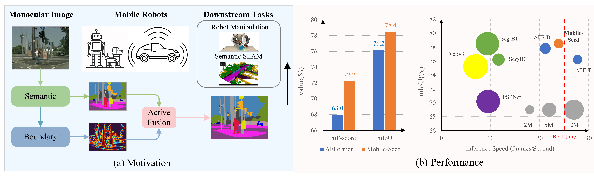

<h2> 
<a href="https://whu-usi3dv.github.io/Mobile-Seed/" target="_blank">Mobile-Seed: Joint Semantic Segmentation and Boundary Detection for Mobile Robots</a>
</h2>

This is the official PyTorch implementation of the following publication:

> **Mobile-Seed: Joint Semantic Segmentation and Boundary Detection for Mobile Robots**<br/>
> [Youqi Liao](https://martin-liao.github.io/), [Shuhao Kang](https://scholar.google.com/citations?user=qB6B7lkAAAAJ&hl=zh-CN&oi=sra), [Jianping Li](https://kafeiyin00.github.io/), [Yang Liu](https://mruil.github.io/), [Yun Liu](https://yun-liu.github.io/), [Zhen Dong](https://dongzhenwhu.github.io/index.html), [Bisheng Yang](https://3s.whu.edu.cn/info/1025/1415.htm),[Xieyuanli Chen](https://xieyuanli-chen.com/),<br/>
> *IEEE RA-L 2024*<br/>
> [**Paper**](https://arxiv.org/abs/2311.12651) | [**Project-page**](https://whu-usi3dv.github.io/Mobile-Seed/) | [**Video**](https://youtu.be/roEAwFKP8Ow)


## 🔭 Introduction
<p align="center">
<strong>TL;DR: Mobile-Seed is an online framework for simultaneous semantic segmentation
and boundary detection on compact robots.</strong>
</p>


<p align="justify">
<strong>Abstract:</strong> Precise and rapid delineation of sharp boundaries
and robust semantics is essential for numerous downstream
robotic tasks, such as robot grasping and manipulation, realtime semantic mapping, and online sensor calibration performed on edge computing units. Although boundary detection
and semantic segmentation are complementary tasks, most
studies focus on lightweight models for semantic segmentation but overlook the critical role of boundary detection. In
this work, we introduce Mobile-Seed, a lightweight, dual-task
framework tailored for simultaneous semantic segmentation
and boundary detection. Our framework features a two-stream
encoder, an active fusion decoder (AFD) and a dual-task regularization approach. The encoder is divided into two pathways:
one captures category-aware semantic information, while the
other discerns boundaries from multi-scale features. The AFD
module dynamically adapts the fusion of semantic and boundary information by learning channel-wise relationships, allowing for precise weight assignment of each channel. Furthermore,
we introduce a regularization loss to mitigate the conflicts in
dual-task learning and deep diversity supervision. Compared to
existing methods, the proposed Mobile-Seed offers a lightweight
framework to simultaneously improve semantic segmentation
performance and accurately locate object boundaries. Experiments on the Cityscapes dataset have shown that Mobile-Seed
achieves notable improvement over the state-of-the-art (SOTA)
baseline by 2.2 percentage points (pp) in mIoU and 4.2 pp
in mF-score, while maintaining an online inference speed of
23.9 frames-per-second (FPS) with 1024×2048 resolution input
on an RTX 2080 Ti GPU. Additional experiments on CamVid
and PASCAL Context datasets confirm our method’s generalizability.
</p>

## 🆕 News
- 2023-11-22: [[Project page]](https://whu-usi3dv.github.io/Mobile-Seed/) (with introduction video) is aviliable!🎉  
- 2023-11-22:  [[Preprint paper]](https://arxiv.org/abs/2311.12651) is aviliable!🎉  
- 2023-11-26: We update the video in the project page with in-depth analysis of our Mobile-Seed. More qualitative results will be available soon!
- 2023-11-27: Introduction [video](https://youtu.be/roEAwFKP8Ow) on YouTube is available now!
- 2024-01-20: Code and pre-trained models are available now !
- 2024-02-21: Accepted by IEEE RAL'24 !
- 2024-03-06: Update the data pre-processing code for Camvid and PASCAL Context datasets!

## 💻 Installation
Our Mobile-Seed is built on [MMsegmentation](https://github.com/open-mmlab/mmsegmentation) 0.29.1. Please refer to the [installation](https://mmsegmentation.readthedocs.io/en/0.x/get_started.html#installation) page  for more details.
A quick installation example: 
```
conda create --name mobileseed python=3.7 -y
conda activate mobileseed
pip install -r requirements.txt
mim install mmengine
mim install mmcv-full
git clone https://github.com/WHU-USI3DV/Mobile-Seed.git
cd Mobile-Seed
pip install -v -e .
```

## 🚅 Usage
### Evaluation
**NOTE: data preprocssing is not necessary for evaluation.**
We provide pre-trained models for Cityscapes, CamVid and PASCAL Context datasets. Please download the weights from [onedrive](https://whueducn-my.sharepoint.com/:f:/g/personal/martin_liao_whu_edu_cn/EoHdpcPhhUJIkKpKUCKRdqIBMTjgvR1lh2nNzS_WeGKCaw?e=k7q3yR) or [Baidu-disk](https://pan.baidu.com/s/1aJhLipP0UuMehInJdlGF7g) (code:MS24) and put them in a folder like ```ckpt/```. We will release our re-trained AFFormer-T weights on the Cityscapes, Camvid and PASCAL Context datasets for reference in the near future.
Example: evaluate  ```Mobile-Seed``` on  ```Cityscapes```:
```
# Single-gpu testing
bash tools/dist_test.sh ./configs/Mobile_Seed/MS_tiny_cityscapes.py /path/to/checkpoint_file.pth 1 --eval mIoU
```

- Mobile-Seed Performance:

|      Dataset    | mIoU | mBIoU (3px) |FLOPs|
|:----------------:|:------------------:|:----------:|:----:|
| Cityscapes  | 78.4    | 43.3 | 31.6G |
| CamVid  |   73.4 | 45.2     |  4.1G  |
| PASCAL Context (60)   |  47.2 | 22.1     | 3.7G |
| PASCAL Context (59)  |   43.0 | 16.2     | 3.7G |

### Training
Download weights of AFFormer pretrained on ImageNet-1K from [google-drive](https://drive.google.com/drive/folders/1Mru24qPdta9o8aLn1RwT8EapiQCih1Sw?usp=share_link) or [alidrive](https://www.aliyundrive.com/s/Ha2xMsG9ufy) and put them in a folder like ```ckpt/```. On the Cityscapes dataset, we trained the Mobile-Seed with an Intel Core i9-13900K CPU and a NVIDIA RTX 4090 GPU for 160K iterations and cost approximately 22 hours.
Example: train ```Mobile-Seed``` on ```Cityscapes```:
```
# Single-gpu training
bash tools/dist_train.sh ./configs/Mobile_Seed/MS_tiny_cityscapes.py

# Multi-gpu training
bash tools/dist_train.sh ./configs/Mobile_Seed/MS_tiny_cityscapes.py <GPU_NUM>
```

### Data preprocessing
#### Cityscapes
- Download the files gtFine_trainvaltest.zip, leftImg8bit_trainvaltest.zip and leftImg8bit_demoVideo.zip from the [Cityscapes website](https://www.cityscapes-dataset.com/) to data_orig/, and unzip them:
```
unzip data_orig/gtFine_trainvaltest.zip -d data_orig && rm data_orig/gtFine_trainvaltest.zip
unzip data_orig/leftImg8bit_trainvaltest.zip -d data_orig && rm data_orig/leftImg8bit_trainvaltest.zip
unzip data_orig/leftImg8bit_demoVideo.zip -d data_orig && rm data_orig/leftImg8bit_demoVideo.zip
```
- create training semantic label:
``
python data_preprocess/cityscapes_preprocess/code/createTrainIdLabelImgs.py <data_path>
``
- Generate .png training semantic boundary labels by running the following command:
```
# In Matlab Command Window
run code/demoPreproc_gen_png_label.m
```
This will create **instance-insensitive** semantic boundary labels for network training in ``data_proc_nis/``.

#### CamVid & PASCAL Context
- semantic boundary label generation:
``
python data_preprocess/camvid_pascal_preprocess/label_generator.py <dataset> <data_path> 
``
We split the training and test set of Camvid according to [PIDNet](https://github.com/XuJiacong/PIDNet) to avoid same-area evaluation.


## 🔦 Demo
Here is a demo script to test a single image. More details refer to [MMSegmentation's Doc](https://mmsegmentation.readthedocs.io/en/latest/user_guides/visualization.html#data-and-results-visualization).
```
python demo/image_demo.py ${IMAGE_FILE} ${CONFIG_FILE} ${CHECKPOINT_FILE} ${SEG_FILE} \
[--out_sebound ${SEBOUND_FILE}] [--out_bibound ${BIBOUND_FILE}] [--device ${DEVICE_NAME}] [--palette-thr ${PALETTE}] 
```
Example: visualize the ```Mobile-Seed``` on  ```Cityscapes```:
```
python demo/image_demo.py demo/demo.png configs/Mobile_Seed/MS_tiny_cityscapes.py \
/path/to/checkpoint_file /path/to/outseg.png --device cuda:0 --palette cityscapes
```

## 💡 Citation
If you find this repo helpful, please give us a star~.Please consider citing Mobile-Seed if this program benefits your project
```
@article{liao2023mobileseed,
  title={Mobile-Seed: Joint Semantic Segmentation and Boundary Detection for Mobile Robots},
  author={Youqi Liao and Shuhao Kang and Jianping Li and Yang Liu and Yun Liu and Zhen Dong and Bisheng Yang and Xieyuanli Chen},
  journal={arXiv: 2311.12651},
  year={2023}
}
```

## 🔗 Related Projects
We sincerely thank the excellent projects:
- [AFFormer](https://github.com/dongbo811/AFFormer) for head-free Transformer;
- [SeaFormer](https://github.com/fudan-zvg/SeaFormer) for Squeeze-enhanced axial Transformer;
- [FreeReg](https://github.com/WHU-USI3DV/FreeReg) for excellent template;
- [DDS](https://github.com/yun-liu/DDS) for a novel view in deep diverse supervision;
- [DFF](https://github.com/Lavender105/DFF) for dynamic feature fusion and Cityscapes data-preprocessing;
